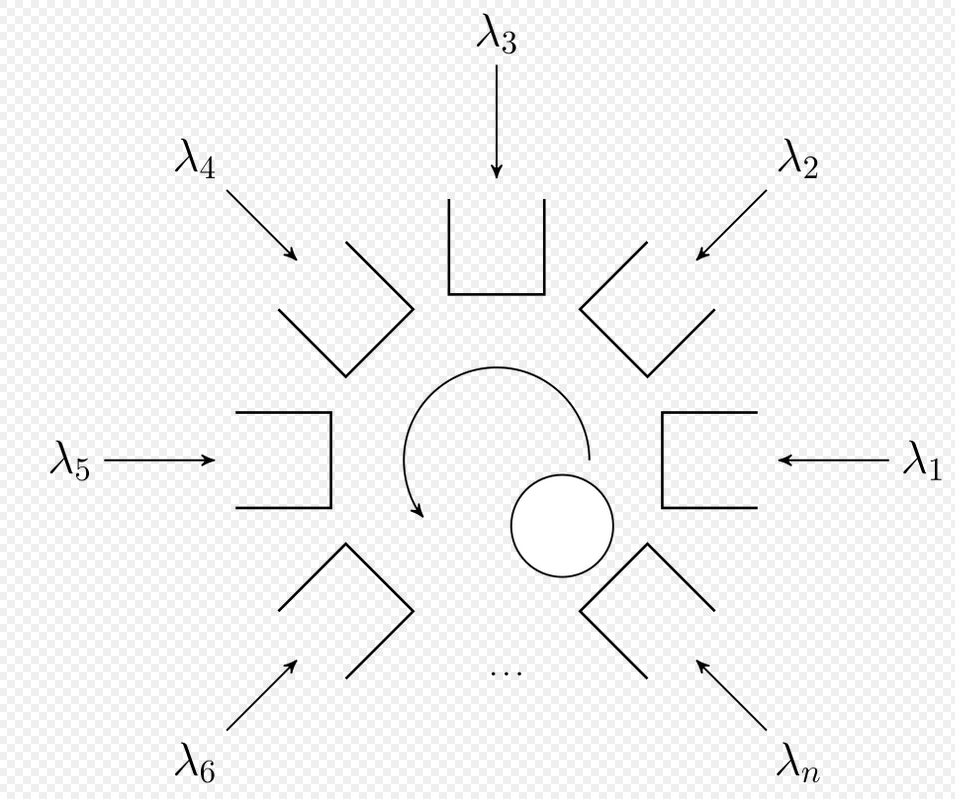

### To look for 
- `epoll`
- `mio`

# Async Await Notes


## `async`

- Defining a function as `async` 
```rust
	async fn foo1() -> usize{
		0
	}
```

results as 

```rust
fn foo1() -> Future<Output = usize> {
	async {
			0
	}
}

```

- The `Future` return type can be thought as `promises` in javascript.


## `await`

If you are awaiting for something, then the desugaring is as follows

```rust
fn foo1() -> Future<Output = usize> {
	async {
		let fut = read_to_string("file1").await;
	}
}

```
results to

```rust
fn foo1() -> Future<Output = usize> {
	async {
		let fut = read_to_string("file1");
		while !fut.is_ready() {
			std::thread::yeild_now();
			fut.try_complete();
		}
	}
}

```
Until the string with the contents of file1 isn't ready, give up a timeslice to the OS scheduler which handles the removal of the runnig process from the CPU and the selection of another process on particular strategy. 

Another rustic way of represent the same thing can be

```rust
let fut = read_to_string("file1");
loop {
if let Some(result) = fut.try_check_completed()  {
		break result;
	} else {
		fut.try_make_progress();
		yield;
	}
}
```

First lets understand the model of the program . Lets say that each block on the figure is awating for the block downwards to do something. There is a call chain. whenever you  yeild you return to top of the call stack. 


```
_________
Function 1  (gets here)-|
---------               |
_________               |
Function 2              |
---------           		|
_________           		|
Function 3       	  		|
---------          		  |
_________           		|
Function 4 -> calls yeild
---------

```


## Async

It can be thought as a big state machine

```rust
let network = read_from_network();
let terminal = read_from_terminal();

select! {
stream <- network.await => {
//do something on stream

}
line <- terminal.await => {
//do something with line
}

}


## Executors

Tokio is executor. The job of a primitive executor would be to poll Futures in a loop.

Here Future means a something that doesn't have value right now but will once the task is complete.  Tokio works on operating system 



Polling basically allows a instance to visit multiple items in a queue to check whether they are available to work upon or not. 


Future is a monad. A monad has two operators, one to wrap a value in monad type. Another to compose together function that output values of a monad types. In Future,operator to wrap a value in monad type is `Future<Success, Fail>` and operator to compose function would be async function that does some task and if it is successful returns success.
```


## Blogs
[https://blog.stephencleary.com/2013/11/there-is-no-thread.html](https://blog.stephencleary.com/2013/11/there-is-no-thread.html)

 


